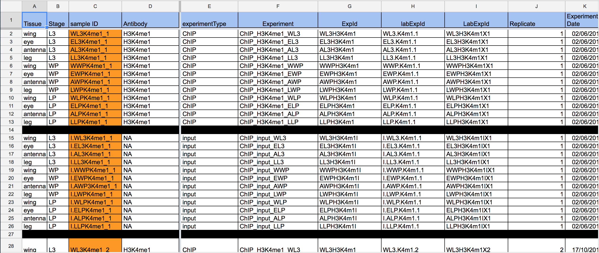

# NGS Data Flow 

<!-- .element: style="margin-top: 1.2em;"-->
### Lab Meeting

------

- Managing experiments, samples, assays data 

- Managing metadata

- Performing analyses

- Publishing raw data and results

------

# Experiment Management

<!-- .slide: data-state="no-nav-bar" data-background="#111111" -->
<!-- .element: class="big light" -->
Do we need a LIMS?

## Maybe not...

## Use Google Docs

- flexible attributes<!-- .element: class="icon plus" -->
- no need to learn how to use a new tool<!-- .element: class="icon plus" -->
- customization<!-- .element: class="icon plus" -->
- no consistency check/enforcing<!-- .element: class="icon minus" -->
- stored on Google servers<!-- .element: class="icon minus" -->

## Other documents

<!-- .element: class="panel panel-default" style="margin-top: 1.5em;" -->
use a shared resource (Dropbox, remote folder) to store all documents related to libraries, sequences and data in general <i class="fa-question fa-lg blue"></i><i class="fa-question fa-lg red fa-rotate-180"></i>

------

# Metadata Management

<!-- .slide: data-state="no-nav-bar" data-background="#111111" -->
<!-- .element: class="big light" -->
Do we need a controlled vocabulary?

## Controlled Vocabulary

- full control on attribute names and values<!-- .element: class="icon plus" -->
- needs time for rigorous definition of all names/values<!-- .element: class="icon minus" -->
- not flexible<!-- .element: class="icon minus" -->

## Metadata Attributes

<!-- .element: class="panel panel-default" style="margin: 2em 0;"-->
Choose a common set of attributes which best describes the project, experiments and data and stick to it

1. unique identifier for each experiment/sample
1. description(s) - check verbosity
1. internal vs public attributes

------

# Data Analysis

## Primary Analysis

- established pipelines
- containerized processing
- data provenance
- [metadata](#/3) management

## RG pipelines

- grape-nf (also for riboprofiling) [<i class="fa-github fa-lg"></i>](https://github.com/guigolab/grape-nf)
- chip-nf [<i class="fa-github"></i>](https://github.com/guigolab/chip-nf)
- ipsa-nf [<i class="fa-github"></i>](https://github.com/guigolab/ipsa-nf)

## Containers

a lightweight, stand-alone, executable package of a piece of software that includes everything needed to run it: code, runtime, system tools, system libraries, settings
<!-- .element: class="panel panel-default" style="margin: 2em 0;"-->

- containerized software will always run the same, regardless of the environment<!-- .element: class="icon plus" -->
- containers isolate software from its surroundings<!-- .element: class="icon plus" -->
- negligible runtime overhead<!-- .element: class="icon plus" -->
- image preparation<!-- .element: class="icon minus" -->
- setup complexity/security<!-- .element: class="icon minus" -->

## Data Provenance

<!-- .element: class="panel panel-default" style="margin: 2em 0;"-->
It refers to records of the inputs, entities, systems, and processes that influence data of interest, providing a historical record of the data and its origins

- pipeline versions
- software versions
- Docker/Singularity image hash

## Other Analyses

- use version control ([git](https://git-scm.com)<!-- .element: class="extern" --> recommended)
- publish on [GitHub](https://github.com)<!-- .element: class="extern" --> (and/or other public resource)
- [data provenance](#/4/3)

------

# Data Publishing

## Strategies

- personal web folder(`public_html`/`public-docs`)
- in-house web server (http://rnaseq.crg.es)<!-- .element: class="extern" -->
- public resources:
    - [NCBI SRA](https://www.ncbi.nlm.nih.gov/sra)<!-- .element: class="extern" -->
    - [EBI ArrayExpress](https://www.ebi.ac.uk/arrayexpress/)<!-- .element: class="extern" -->
- hybrid (in-house + public)

------

## THANKS!
<!-- .element: style="font-size: 3.2em" -->